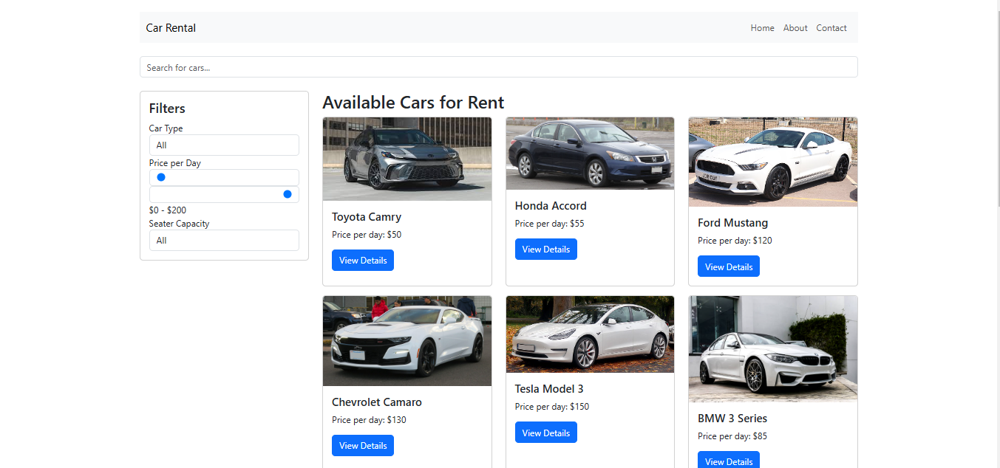
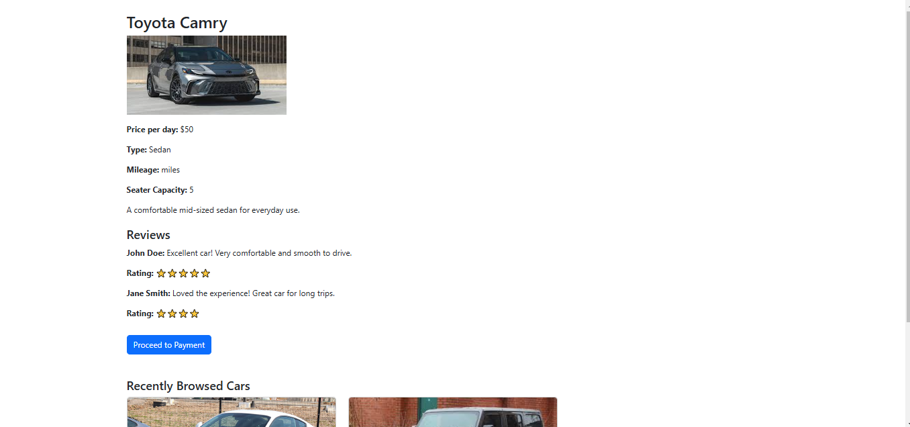
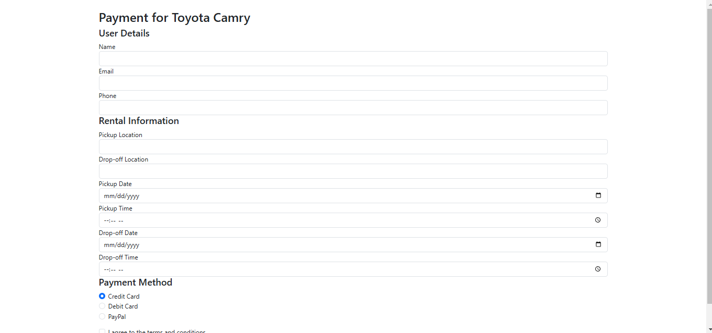

## Installation and Setup

1. **Clone the repository:**
   ```
   git clone https://github.com/your-username/car-rental-app.git
   cd car-rental-app
   ```
2. **Install dependencies:**
   ```
   npm install
   ```
3. **Start the development server:**
   ```
   npm run dev
   ```

4. Open the application in your browser
   ```
   http://localhost:5173
   ```

# Car Rental Web Application

A responsive car rental application built with React and Vite.

## Screenshots

### Home Page


### Car Details Page


### Payment Page


